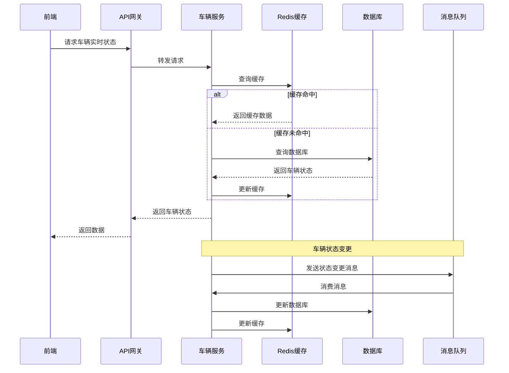

# MineGuard 后端架构设计文档

## 1. 技术选型

### 1.1 核心技术栈

- **语言**：Java 24（以 `backend/pom.xml` 的 `java.version` 为准）
- **框架**：Spring Boot 3.5.10（以 `backend/pom.xml` 为准）
- **微服务框架**：Spring Cloud Alibaba
- **关系型数据库**：MySQL 8.0
- **文档型数据库**：MongoDB 6.0
- **缓存**：Redis
- **消息队列**：RabbitMQ
- **实时通讯**：WebSocket
- **AI框架**：Spring AI
- **对象存储**：阿里云OSS
- **OCR服务**：百度OCR API
- **地图服务**：高德地图API

> 注意：本文档描述“目标架构与模块边界”。配置（YAML/Nacos）的拆分、加载顺序与“避免重复导致错乱”的硬规则，统一以 `docs/后端拆解-yml-rule.md` 为准，避免多处维护产生冲突。

### 1.2 技术特性

- **微服务架构**：服务拆分、独立部署
- **高可用性**：集群部署、负载均衡
- **可扩展性**：服务横向扩展
- **安全性**：认证授权、数据加密

## 2. 系统架构

### 2.1 架构图

```txt
+---------------------+     +---------------------+     +---------------------+
|                     |     |                     |     |                     |
|   前端应用 (uni-app)  | <--> |  API 网关 (Gateway)  | <--> |  微服务集群         |
|                     |     |                     |     |                     |
+---------------------+     +---------------------+     +---------------------+
                                                            |
                                                            |
                                                            v
                                                    +---------------------+
                                                    |                     |
                                                    |  中间件服务         |
                                                    |                     |
                                                    +---------------------+
                                                            |
                                                            |
                                                            v
                                                    +---------------------+
                                                    |                     |
                                                    |  数据存储           |
                                                    |                     |
                                                    +---------------------+
```

### 2.2 服务拆分

| 服务名称 | 服务说明 | 端口 | 主要功能 |
| --- | --- | --- | --- |
| user-service | 用户服务 | 8081 | 用户管理、认证授权、司机管理 |
| trip-service | 行程服务 | 8084 | 行程记录、路线规划、轨迹追踪 |
| dispatch-service | 调度服务 | - | 任务调度、资源分配 |
| warning-service | 预警服务 | - | 预警管理、事件处理 |
| statistics-service | 统计服务 | - | 数据分析、报表生成 |
| cost-service | 成本服务 | - | 成本核算、费用管理 |
| ai-service | AI分析服务 | - | 预测分析、智能推荐 |
| python-service | Python服务 | - | Python算法服务 |
| gateway-service | 网关服务 | - | 请求路由、安全控制 |

### 2.3 公共模块拆分

| 模块名称 | 模块说明 | 主要依赖 | 职责描述 |
| --- | --- | --- | --- |
| mineguard-common-core | 核心工具模块 | 无 | 统一异常、统一响应、工具类、常量定义、枚举类、Client接口 |
| mineguard-common-web | Web配置模块 | mineguard-common-core | 统一拦截器、跨域配置、日志切面、参数校验 |
| mineguard-common-database | 数据库模块 | mineguard-common-core | MyBatis-Plus配置、数据源配置、分页插件、多数据源支持 |
| mineguard-common-redis | Redis模块 | mineguard-common-core | RedisTemplate配置、缓存序列化、分布式锁、限流器 |
| mineguard-common-mq | 消息队列模块 | mineguard-common-core | RabbitMQ配置、消息生产者/消费者模板、事务消息 |
| mineguard-common-auth | 认证授权模块 | mineguard-common-core, mineguard-common-redis | JWT工具、权限注解、用户上下文、RBAC工具 |
| mineguard-common-mongodb | MongoDB模块 | mineguard-common-core | MongoTemplate配置、地理空间查询、聚合查询、时序数据支持 |
| mineguard-common-websocket | WebSocket模块 | mineguard-common-core, mineguard-common-mongodb | WebSocket连接管理、消息推送、消息订阅/发布、在线用户管理 |
| mineguard-common-file | 文件存储模块 | mineguard-common-core | 阿里云OSS配置、文件上传下载、OCR识别工具 |
| mineguard-common-map | 地图服务模块 | mineguard-common-core | 高德地图API集成、地理编码、路径规划、地理围栏、位置搜索 |

**模块依赖关系**：

```tree
mineguard-common-core (基础层，包含所有Client接口)
    ↑
    ├── mineguard-common-web
    ├── mineguard-common-database
    ├── mineguard-common-redis
    ├── mineguard-common-mq
    ├── mineguard-common-auth
    │   └── mineguard-common-redis
    ├── mineguard-common-mongodb
    ├── mineguard-common-websocket
    │   └── mineguard-common-mongodb
    ├── mineguard-common-file
    └── mineguard-common-map
```

**设计优势**：

- 按职责拆分，每个模块职责单一，避免common模块臃肿
- 各业务服务按需引入依赖，减少不必要的依赖包
- 便于独立升级和维护，降低耦合度
- 提高代码复用性，统一技术栈实现

### 2.4 核心流程图

#### 车辆状态监控流程



## 3. 数据库设计

### 3.1 核心表结构

#### 1. 用户表 (user)

| 字段名 | 数据类型 | 约束 | 描述 |
| ----- | ------- | ---- | ---- |
| id | BIGINT | PRIMARY KEY | 用户ID |
| username | VARCHAR(50) | UNIQUE | 用户名 |
| password | VARCHAR(100) | NOT NULL | 密码 |
| role | VARCHAR(20) | NOT NULL | 角色 |
| name | VARCHAR(50) | NOT NULL | 姓名 |
| phone | VARCHAR(20) | NOT NULL | 手机号 |
| create_time | DATETIME | NOT NULL | 创建时间 |
| update_time | DATETIME | NOT NULL | 更新时间 |

#### 2. 车辆表 (car)

| 字段名 | 数据类型 | 约束 | 描述 |
| ------ | ------- | ---- | ---- |
| id | BIGINT | PRIMARY KEY | 车辆ID |
| car_number | VARCHAR(20) | UNIQUE | 车牌号 |
| vehicle_type | VARCHAR(50) | NOT NULL | 车辆类型 |
| model | VARCHAR(50) | NOT NULL | 车型 |
| status | VARCHAR(20) | NOT NULL | 状态 |
| purchase_date | DATE | NOT NULL | 购买日期 |
| insurance_company | VARCHAR(100) | | 保险公司 |
| insurance_number | VARCHAR(100) | | 保险单号 |
| insurance_expiry | DATE | | 保险到期日 |
| create_time | DATETIME | NOT NULL | 创建时间 |
| update_time | DATETIME | NOT NULL | 更新时间 |

#### 3. 司机表 (driver)

| 字段名 | 数据类型 | 约束 | 描述 |
| ------ | ------- | ---- | ---- |
| id | BIGINT | PRIMARY KEY | 司机ID |
| name | VARCHAR(50) | NOT NULL | 姓名 |
| phone | VARCHAR(20) | NOT NULL | 手机号 |
| license_number | VARCHAR(50) | UNIQUE | 驾驶证号 |
| status | VARCHAR(20) | NOT NULL | 状态 |
| create_time | DATETIME | NOT NULL | 创建时间 |
| update_time | DATETIME | NOT NULL | 更新时间 |

#### 4. 行程记录表 (trip_record)

| 字段名 | 数据类型 | 约束 | 描述 |
| ------ | ------- | ---- | ---- |
| id | BIGINT | PRIMARY KEY | 行程ID |
| car_id | BIGINT | FOREIGN KEY | 车辆ID |
| driver_id | BIGINT | FOREIGN KEY | 司机ID |
| route_id | BIGINT | FOREIGN KEY | 路线ID |
| start_time | DATETIME | NOT NULL | 开始时间 |
| end_time | DATETIME | | 结束时间 |
| start_point | VARCHAR(100) | NOT NULL | 起点 |
| end_point | VARCHAR(100) | NOT NULL | 终点 |
| distance | DOUBLE | | 距离 |
| load_weight | DOUBLE | | 载重 |
| status | VARCHAR(20) | NOT NULL | 状态 |
| create_time | DATETIME | NOT NULL | 创建时间 |
| update_time | DATETIME | NOT NULL | 更新时间 |

#### 5. 预警记录表 (warning_record)

| 字段名 | 数据类型 | 约束 | 描述 |
| ------ | ------- | ---- | ---- |
| id | BIGINT | PRIMARY KEY | 预警ID |
| car_id | BIGINT | FOREIGN KEY | 车辆ID |
| driver_id | BIGINT | FOREIGN KEY | 司机ID |
| warning_type | VARCHAR(50) | NOT NULL | 预警类型 |
| warning_level | VARCHAR(20) | NOT NULL | 预警级别 |
| warning_time | DATETIME | NOT NULL | 预警时间 |
| location | VARCHAR(100) | | 位置 |
| description | TEXT | | 描述 |
| status | VARCHAR(20) | NOT NULL | 状态 |
| create_time | DATETIME | NOT NULL | 创建时间 |
| update_time | DATETIME | NOT NULL | 更新时间 |

#### 6. 车辆实时状态表 (vehicle_realtime_status)

| 字段名 | 数据类型 | 约束 | 描述 |
| ------ | ------- | ---- | ---- |
| id | BIGINT | PRIMARY KEY | ID |
| car_id | BIGINT | FOREIGN KEY | 车辆ID |
| longitude | DOUBLE | | 经度 |
| latitude | DOUBLE | | 纬度 |
| speed | DOUBLE | | 速度 |
| status | VARCHAR(20) | | 状态 |
| fuel_level | DOUBLE | | 油量 |
| last_update_time | DATETIME | NOT NULL | 最后更新时间 |

#### 7. 设备表 (device)

| 字段名 | 数据类型 | 约束 | 描述 |
| ------ | ------- | ---- | ---- |
| id | BIGINT | PRIMARY KEY | 设备ID |
| device_id | VARCHAR(50) | UNIQUE | 设备唯一标识 |
| device_name | VARCHAR(100) | NOT NULL | 设备名称 |
| device_type | VARCHAR(50) | NOT NULL | 设备类型 |
| protocol | VARCHAR(20) | NOT NULL | 通信协议 |
| car_id | BIGINT | FOREIGN KEY | 关联车辆ID |
| status | VARCHAR(20) | NOT NULL | 设备状态 |
| last_online_time | DATETIME | | 最后在线时间 |
| config | JSON | | 设备配置 |
| create_time | DATETIME | NOT NULL | 创建时间 |
| update_time | DATETIME | NOT NULL | 更新时间 |

#### 8. 设备数据表 (device_data)

| 字段名 | 数据类型 | 约束 | 描述 |
| ------ | ------- | ---- | ---- |
| id | BIGINT | PRIMARY KEY | 数据ID |
| device_id | VARCHAR(50) | NOT NULL | 设备ID |
| data_type | VARCHAR(50) | NOT NULL | 数据类型 |
| data_value | JSON | NOT NULL | 数据值 |
| data_time | DATETIME | NOT NULL | 数据时间 |
| create_time | DATETIME | NOT NULL | 创建时间 |

### 3.2 索引设计

| 表名 | 索引名 | 索引类型 | 字段 | 描述 |
| ---- | ------ | ------- | ---- | ---- |
| user | idx_username | UNIQUE | username | 用户名索引 |
| car | idx_car_number | UNIQUE | car_number | 车牌号索引 |
| car | idx_vehicle_type | NORMAL | vehicle_type | 车辆类型索引 |
| car | idx_status | NORMAL | status | 状态索引 |
| driver | idx_license_number | UNIQUE | license_number | 驾驶证号索引 |
| trip_record | idx_car_id | NORMAL | car_id | 车辆ID索引 |
| trip_record | idx_driver_id | NORMAL | driver_id | 司机ID索引 |
| trip_record | idx_start_time | NORMAL | start_time | 开始时间索引 |
| warning_record | idx_car_id | NORMAL | car_id | 车辆ID索引 |
| warning_record | idx_warning_time | NORMAL | warning_time | 预警时间索引 |
| warning_record | idx_warning_type | NORMAL | warning_type | 预警类型索引 |
| vehicle_realtime_status | idx_car_id | NORMAL | car_id | 车辆ID索引 |
| vehicle_realtime_status | idx_last_update_time | NORMAL | last_update_time | 最后更新时间索引 |
| device | idx_device_id | UNIQUE | device_id | 设备ID索引 |
| device | idx_device_type | NORMAL | device_type | 设备类型索引 |
| device | idx_car_id | NORMAL | car_id | 关联车辆ID索引 |
| device | idx_status | NORMAL | status | 设备状态索引 |
| device_data | idx_device_id | NORMAL | device_id | 设备ID索引 |
| device_data | idx_data_type | NORMAL | data_type | 数据类型索引 |
| device_data | idx_data_time | NORMAL | data_time | 数据时间索引 |

### 3.3 分区设计

| 表名 | 分区类型 | 分区字段 | 分区策略 |
| ---- | ------- | ------- | -------- |
| trip_record | RANGE | start_time | 按年分区 |
| warning_record | RANGE | warning_time | 按年分区 |
| device_data | RANGE | data_time | 按月分区 |

### 3.4 MongoDB集合设计

#### 1. 车辆轨迹集合 (vehicle_trajectory)

| 字段名 | 数据类型 | 索引 | 描述 |
| ------ | ------- | ---- | ---- |
| _id | ObjectId | PRIMARY | 文档ID |
| carId | Long | INDEXED | 车辆ID |
| timestamp | Date | INDEXED | 时间戳 |
| location | GeoJSON2DSphere | 2DSPHERE | 地理位置 |
| speed | Double | - | 速度 |
| direction | Double | - | 方向 |
| fuelLevel | Double | - | 油量 |
| status | String | INDEXED | 状态 |
| metadata | Object | - | 元数据 |

**索引设计**：

```javascript
// 车辆ID索引
db.vehicle_trajectory.createIndex({ "carId": 1 })

// 时间索引
db.vehicle_trajectory.createIndex({ "timestamp": -1 })

// 地理空间索引
db.vehicle_trajectory.createIndex({ "location": "2dsphere" })

// 复合索引
db.vehicle_trajectory.createIndex({ "carId": 1, "timestamp": -1 })

// TTL索引（6个月后自动删除）
db.vehicle_trajectory.createIndex({ "timestamp": 1 }, { expireAfterSeconds: 15552000 })
```

#### 2. 预警事件集合 (warning_event)

| 字段名 | 数据类型 | 索引 | 描述 |
| ------ | ------- | ---- | ---- |
| _id | ObjectId | PRIMARY | 文档ID |
| warningId | Long | UNIQUE | 预警ID |
| carId | Long | INDEXED | 车辆ID |
| driverId | Long | INDEXED | 司机ID |
| warningType | String | INDEXED | 预警类型 |
| warningLevel | String | INDEXED | 预警级别 |
| warningTime | Date | INDEXED | 预警时间 |
| location | GeoJSON2DSphere | 2DSPHERE | 预警位置 |
| description | String | - | 预警描述 |
| details | Object | - | 详细信息 |
| status | String | INDEXED | 状态 |
| handleInfo | Object | - | 处理信息 |

**索引设计**：

```javascript
// 预警ID索引
db.warning_event.createIndex({ "warningId": 1 }, { unique: true })

// 车辆ID索引
db.warning_event.createIndex({ "carId": 1 })

// 预警时间索引
db.warning_event.createIndex({ "warningTime": -1 })

// 预警类型索引
db.warning_event.createIndex({ "warningType": 1 })

// 复合索引
db.warning_event.createIndex({ "carId": 1, "warningTime": -1 })

// TTL索引（1年后自动删除）
db.warning_event.createIndex({ "warningTime": 1 }, { expireAfterSeconds: 31536000 })
```

#### 3. 操作日志集合 (operation_log)

| 字段名 | 数据类型 | 索引 | 描述 |
| ------ | ------- | ---- | ---- |
| _id | ObjectId | PRIMARY | 文档ID |
| logId | Long | UNIQUE | 日志ID |
| userId | Long | INDEXED | 用户ID |
| username | String | INDEXED | 用户名 |
| operation | String | INDEXED | 操作类型 |
| module | String | INDEXED | 模块名称 |
| ip | String | - | IP地址 |
| userAgent | String | - | 用户代理 |
| requestTime | Date | INDEXED | 请求时间 |
| requestBody | Object | - | 请求体 |
| responseTime | Date | - | 响应时间 |
| duration | Long | - | 耗时 |
| result | String | - | 结果 |

**索引设计**：

```javascript
// 日志ID索引
db.operation_log.createIndex({ "logId": 1 }, { unique: true })

// 用户ID索引
db.operation_log.createIndex({ "userId": 1 })

// 操作类型索引
db.operation_log.createIndex({ "operation": 1 })

// 请求时间索引
db.operation_log.createIndex({ "requestTime": -1 })

// TTL索引（30天后自动删除）
db.operation_log.createIndex({ "requestTime": 1 }, { expireAfterSeconds: 2592000 })
```

#### 4. 设备上报数据集合 (device_data)

| 字段名 | 数据类型 | 索引 | 描述 |
| ------ | ------- | ---- | ---- |
| _id | ObjectId | PRIMARY | 文档ID |
| deviceId | String | INDEXED | 设备ID |
| carId | Long | INDEXED | 车辆ID |
| timestamp | Date | INDEXED | 时间戳 |
| sensors | Object | - | 传感器数据 |
| status | String | INDEXED | 状态 |

**索引设计**：

```javascript
// 设备ID索引
db.device_data.createIndex({ "deviceId": 1 })

// 车辆ID索引
db.device_data.createIndex({ "carId": 1 })

// 时间索引
db.device_data.createIndex({ "timestamp": -1 })

// 复合索引
db.device_data.createIndex({ "deviceId": 1, "timestamp": -1 })

// TTL索引（3个月后自动删除）
db.device_data.createIndex({ "timestamp": 1 }, { expireAfterSeconds: 7776000 })
```

#### 5. 消息历史集合 (message_history)

| 字段名 | 数据类型 | 索引 | 描述 |
| ------ | ------- | ---- | ---- |
| _id | ObjectId | PRIMARY | 文档ID |
| messageId | String | UNIQUE | 消息ID |
| messageType | String | INDEXED | 消息类型 |
| sender | String | INDEXED | 发送者 |
| receiver | String | INDEXED | 接收者 |
| timestamp | Date | INDEXED | 时间戳 |
| content | Object | - | 消息内容 |
| status | String | INDEXED | 状态 |
| readTime | Date | - | 已读时间 |

**索引设计**：

```javascript
// 消息ID索引
db.message_history.createIndex({ "messageId": 1 }, { unique: true })

// 接收者索引
db.message_history.createIndex({ "receiver": 1, "timestamp": -1 })

// 消息类型索引
db.message_history.createIndex({ "messageType": 1 })

// TTL索引（30天后自动删除）
db.message_history.createIndex({ "timestamp": 1 }, { expireAfterSeconds: 2592000 })
```

## 4. 接口设计

### 4.1 认证授权接口

| API路径 | 方法 | 模块 | 功能描述 | 请求体 (JSON) | 成功响应 (200 OK) |
| ------- | ---- | ---- | -------- | ------------ | ----------------- |
| /api/auth/login | POST | user-service | 用户登录 | {"username": "admin", "password": "123456", "role": "admin"} | {"token": "...", "userInfo": {...}} |
| /api/auth/logout | POST | user-service | 用户登出 | {} | {"code": 200, "message": "success"} |
| /api/auth/refresh | POST | user-service | 刷新令牌 | {"token": "..."} | {"token": "..."} |

### 4.2 车辆管理接口

| API路径 | 方法 | 模块 | 功能描述 | 请求体 (JSON) | 成功响应 (200 OK) |
| ------- | ---- | ---- | -------- | ------------ | ----------------- |
| /api/vehicle/list | GET | vehicle-service | 获取车辆列表 | N/A | {"total": 100, "data": [...]} |
| /api/vehicle/detail/{id} | GET | vehicle-service | 获取车辆详情 | N/A | {"id": 1, "carNumber": "鄂A12345", ...} |
| /api/vehicle/status | GET | vehicle-service | 获取车辆实时状态 | N/A | {"carId": 1, "status": "running", ...} |
| /api/vehicle/add | POST | vehicle-service | 添加车辆 | {"carNumber": "鄂A12345", "vehicleType": "重型卡车", ...} | {"code": 200, "message": "success"} |
| /api/vehicle/update | PUT | vehicle-service | 更新车辆信息 | {"id": 1, "status": "idle", ...} | {"code": 200, "message": "success"} |
| /api/vehicle/delete/{id} | DELETE | vehicle-service | 删除车辆 | N/A | {"code": 200, "message": "success"} |

### 4.3 行程管理接口

| API路径 | 方法 | 模块 | 功能描述 | 请求体 (JSON) | 成功响应 (200 OK) |
| ------- | ---- | ---- | -------- | ------------ | ----------------- |
| /api/trip/list | GET | trip-service | 获取行程列表 | N/A | {"total": 100, "data": [...]} |
| /api/trip/detail/{id} | GET | trip-service | 获取行程详情 | N/A | {"id": 1, "carId": 1, ...} |
| /api/trip/add | POST | trip-service | 添加行程 | {"carId": 1, "driverId": 1, ...} | {"code": 200, "message": "success"} |
| /api/trip/update | PUT | trip-service | 更新行程 | {"id": 1, "status": "completed", ...} | {"code": 200, "message": "success"} |
| /api/trip/delete/{id} | DELETE | trip-service | 删除行程 | N/A | {"code": 200, "message": "success"} |

### 4.4 预警管理接口

| API路径 | 方法 | 模块 | 功能描述 | 请求体 (JSON) | 成功响应 (200 OK) |
| ------- | ---- | ---- | -------- | ------------ | ----------------- |
| /api/warning/list | GET | warning-service | 获取预警列表 | N/A | {"total": 100, "data": [...]} |
| /api/warning/detail/{id} | GET | warning-service | 获取预警详情 | N/A | {"id": 1, "warningType": "超速", ...} |
| /api/warning/handle | POST | warning-service | 处理预警 | {"id": 1, "handleResult": "已处理", ...} | {"code": 200, "message": "success"} |

### 4.5 统计分析接口

| API路径 | 方法 | 模块 | 功能描述 | 请求体 (JSON) | 成功响应 (200 OK) |
| ------- | ---- | ---- | -------- | ------------ | ----------------- |
| /api/statistics/vehicle | GET | statistics-service | 车辆统计 | N/A | {"total": 100, "running": 50, ...} |
| /api/statistics/trip | GET | statistics-service | 行程统计 | N/A | {"total": 1000, "distance": 50000, ...} |
| /api/statistics/warning | GET | statistics-service | 预警统计 | N/A | {"total": 100, "handled": 80, ...} |

### 4.6 成本管理接口

| API路径 | 方法 | 模块 | 功能描述 | 请求体 (JSON) | 成功响应 (200 OK) |
| ------- | ---- | ---- | -------- | ------------ | ----------------- |
| /api/cost/list | GET | cost-service | 获取成本列表 | N/A | {"total": 100, "data": [...]} |
| /api/cost/add | POST | cost-service | 添加成本 | {"carId": 1, "costType": "燃油", "amount": 500, ...} | {"code": 200, "message": "success"} |
| /api/cost/statistics | GET | cost-service | 成本统计 | N/A | {"total": 10000, "fuel": 5000, ...} |

### 4.7 AI分析接口

| API路径 | 方法 | 模块 | 功能描述 | 请求体 (JSON) | 成功响应 (200 OK) |
| ------- | ---- | ---- | -------- | ------------ | ----------------- |
| /api/ai/predict/fault | POST | ai-service | 车辆故障预测 | {"carId": 1, ...} | {"faultProbability": 0.85, ...} |
| /api/ai/optimize/route | POST | ai-service | 路线优化 | {"startPoint": "...", "endPoint": "...", ...} | {"optimizedRoute": [...], ...} |
| /api/ai/recommend/dispatch | POST | ai-service | 调度推荐 | {"tripId": 1, ...} | {"recommendedDriver": 1, ...} |

### 4.8 IoT设备接口

| API路径 | 方法 | 模块 | 功能描述 | 请求体 (JSON) | 成功响应 (200 OK) |
| ------- | ---- | ---- | -------- | ------------ | ----------------- |
| /api/iot/device/list | GET | iot-service | 获取设备列表 | N/A | {"total": 100, "data": [...]} |
| /api/iot/device/register | POST | iot-service | 设备注册 | {"deviceId": "...", "deviceType": "...", ...} | {"code": 200, "message": "success"} |
| /api/iot/device/control | POST | iot-service | 设备控制 | {"deviceId": "...", "command": "...", ...} | {"code": 200, "message": "success"} |
| /api/iot/device/data | GET | iot-service | 获取设备数据 | N/A | {"deviceId": "...", "data": {...}, ...} |

### 4.9 文件服务接口

| API路径 | 方法 | 模块 | 功能描述 | 请求体 (JSON) | 成功响应 (200 OK) |
| ------- | ---- | ---- | -------- | ------------ | ----------------- |
| /api/file/upload | POST | file-service | 文件上传 | multipart/form-data | {"fileId": "...", "url": "...", "filename": "..."} |
| /api/file/download/{fileId} | GET | file-service | 文件下载 | N/A | 文件流 |
| /api/file/delete/{fileId} | DELETE | file-service | 文件删除 | N/A | {"code": 200, "message": "success"} |
| /api/file/ocr/id-card | POST | file-service | 身份证OCR识别 | {"fileId": "..."} | {"name": "...", "idNumber": "...", "gender": "...", "birthDate": "...", "address": "..."} |
| /api/file/ocr/driver-license | POST | file-service | 驾驶证OCR识别 | {"fileId": "..."} | {"name": "...", "licenseNumber": "...", "gender": "...", "birthDate": "...", "issueDate": "...", "expiryDate": "..."} |
| /api/file/ocr/vehicle-license | POST | file-service | 行驶证OCR识别 | {"fileId": "..."} | {"plateNumber": "...", "vehicleType": "...", "owner": "...", "model": "...", "issueDate": "...", "expiryDate": "..."} |

## 5. 技术实现

### 5.1 公共模块实现

#### 1. mineguard-common-core 模块

**核心功能**：

- 统一异常类：`BaseException`、`BusinessException`、`SystemException`
- 统一异常处理策略：`ExceptionHandlerStrategy`、`BusinessExceptionHandlerStrategy`、`SystemExceptionHandlerStrategy`、`DefaultExceptionHandlerStrategy`、`ExceptionHandlerRegistry`
- 统一响应类：`Result<T>`、`PageResult<T>`
- 通用工具类：`StringUtils`、`DateUtils`、`JsonUtils`、`EncryptUtils`、`ValidateUtils`
- 常量定义：`CacheConstants`、`PaginationConstants`、`RedisKeyConstants`、`StatusConstants`
- 枚举类：`ResultCodeEnum`、`UserStatusEnum`、`UserTypeEnum`、`VehicleStatusEnum`、`TripStatusEnum`
- 配置类：`BaseEntityAutoFillConfig`
- 领域类：`BaseEntity`、`PageRequest`

#### 2. mineguard-common-web 模块

**核心功能**：

- 统一异常处理器：`GlobalExceptionHandler`
- 跨域配置：`CorsConfig`
- 请求日志切面：`RequestLogAspect`
- 参数校验：`@Validated` 注解支持

#### 3. mineguard-common-database 模块

**核心功能**：

- MyBatis-Plus 配置：`MybatisPlusConfig`
- 数据源配置：`DataSourceConfig`
- 分页插件：`PaginationInnerInterceptor`
- 多数据源支持：`DynamicDataSource`
- 通用 BaseMapper：`BaseMapper<T>`

#### 4. mineguard-common-redis 模块

**核心功能**：

- RedisTemplate 配置：`RedisConfig`
- 缓存序列化：`Jackson2JsonRedisSerializer`
- 分布式锁：`RedisDistributedLock`
- 限流器：`RedisRateLimiter`
- 缓存工具类：`RedisCache`

#### 5. mineguard-common-mq 模块

**核心功能**：

- RocketMQ 配置：`RocketMQConfig`
- 消息生产者模板：`MessageProducer`
- 消息消费者模板：`MessageConsumer`
- 事务消息支持：`TransactionalMessageProducer`
- 消息重试机制：`MessageRetryStrategy`

#### 6. mineguard-common-auth 模块

**核心功能**：

- JWT 工具类：`JwtUtils`
- 权限注解：`@RequirePermission`、`@RequireRole`
- 用户上下文：`UserContext`
- RBAC 工具：`PermissionUtils`
- Token 过滤器：`JwtAuthenticationFilter`

#### 7. mineguard-common-log 模块

**核心功能**：

- 日志切面：`OperationLogAspect`
- 异步日志：`AsyncLogService`
- 日志脱敏：`SensitiveDataFilter`
- 审计日志：`AuditLogService`
- 日志存储：`LogStorageService`

#### 8. mineguard-common-file 模块

**核心功能**：

- MinIO配置：`MinioConfig`
- 文件上传：`FileUploadService`
- 文件下载：`FileDownloadService`
- 文件管理：`FileManagerService`
- OCR识别：`OcrService`
- 文件路径生成：`FilePathGenerator`
- 文件类型验证：`FileTypeValidator`

### 5.2 微服务实现

#### 1. 服务注册与发现

- **组件**：Nacos
- **配置**：服务注册到 Nacos 服务器
- **功能**：服务自动发现、负载均衡

#### 2. 文件服务实现

- **组件**：MinIO、阿里云OSS、Tesseract OCR / 百度OCR API
- **配置**：
  - MinIO客户端配置
  - 阿里云OSS客户端配置
  - OCR服务配置
  - 文件存储路径配置
  - 文件大小限制配置
  - 容灾备份策略配置
- **功能**：
  - 文件上传到MinIO（主存储）
  - 文件同步到阿里云OSS（容灾备份）
  - 文件下载与预览（优先从MinIO读取，失败自动切换到阿里云OSS）
  - 文件管理（删除、重命名，同步到两个存储源）
  - 身份证OCR识别
  - 驾驶证OCR识别
  - 行驶证OCR识别
  - OCR识别结果缓存
  - 存储源健康检查和自动切换

#### 3. 配置中心

- **组件**：Nacos Config
- **配置**：集中管理服务配置
- **功能**：动态配置更新、配置版本管理

#### 4. 网关

- **组件**：Spring Cloud Gateway
- **配置**：路由规则、过滤器
- **功能**：请求转发、认证授权、限流

#### 5. 服务调用

- **组件**：Spring 6 HTTP Exchange Client
- **配置**：服务接口定义在 `mineguard-common-core` 的 `client` 包中
- **功能**：声明式服务调用、负载均衡
- **Client接口**：UserClient, VehicleClient, TripClient, DispatchClient, WarningClient, CostClient, AiClient, StatisticsClient, DriverClient, MessageClient, TaskClient, TransportClient, PythonClient, GaodeMapClient

#### 6. 熔断降级

- **组件**：Sentinel
- **配置**：熔断规则、降级策略
- **功能**：服务保护、故障隔离

#### 7. 分布式事务

- **组件**：Seata
- **配置**：事务组、模式
- **功能**：分布式事务协调、一致性保证

### 5.3 缓存实现

#### 1. 缓存策略

- **缓存级别**：
  - 本地缓存：Caffeine
  - 分布式缓存：Redis
- **缓存键设计**：
  - 车辆状态：`vehicle:status:{carId}`
  - 用户信息：`user:{userId}`
  - 统计数据：`statistics:{type}:{date}`

#### 2. 缓存更新

- **更新策略**：
  - 主动更新：数据变更时更新缓存
  - 被动更新：缓存过期后重新加载
- **过期时间**：
  - 车辆状态：30秒
  - 用户信息：30分钟
  - 统计数据：1小时

### 5.4 消息队列实现

#### 1. 消息主题

- **车辆状态**：`vehicle-status-change`
- **预警信息**：`warning-notification`
- **行程完成**：`trip-completed`
- **统计数据**：`statistics-update`

#### 2. 消息处理

- **生产者**：服务发送消息
- **消费者**：服务消费消息
- **消息类型**：
  - 同步消息：实时处理
  - 异步消息：批量处理

### 5.5 MongoDB实现

#### 1. 数据存储策略

| 数据类型 | 存储集合 | 索引策略 | 数据保留 |
| ------- | ------- | ------- | ------- |
| 车辆轨迹历史 | vehicle_trajectory | 地理空间索引、时间索引 | 6个月 |
| 预警事件历史 | warning_event | 复合索引、TTL索引 | 1年 |
| 操作日志 | operation_log | 时间索引、用户索引 | 30天 |
| 设备上报数据 | device_data | 时间索引、设备ID索引 | 3个月 |
| 消息历史 | message_history | 消息ID索引、接收者索引 | 30天 |

#### 2. 车辆轨迹数据模型

```json
{
  "_id": ObjectId("..."),
  "carId": 1001,
  "timestamp": ISODate("2024-01-15T10:30:00Z"),
  "location": {
    "type": "Point",
    "coordinates": [114.123456, 30.654321]
  },
  "speed": 45.5,
  "direction": 180,
  "fuelLevel": 75.2,
  "status": "running",
  "metadata": {
    "driverId": 2001,
    "tripId": 3001
  }
}
```

#### 3. 地理空间查询

- **附近车辆查询**：查询指定范围内的车辆
- **轨迹回放**：查询指定时间段的车辆轨迹
- **区域监控**：监控指定区域内的车辆

#### 4. 聚合统计

- **行驶里程统计**：按时间、车辆统计行驶里程
- **预警趋势分析**：按时间、类型统计预警数量
- **车辆活跃度**：统计车辆在线时长和行驶次数

### 5.6 WebSocket实现

#### 1. 实时通讯场景

| 场景 | 消息类型 | 推送对象 | 触发条件 |
| ---- | ------- | ------- | ------- |
| 车辆状态变更 | vehicle_status | 调度中心 | 车辆位置/状态变化 |
| 预警通知 | warning_notification | 调度中心、司机端 | 预警事件触发 |
| 调度指令下发 | dispatch_command | 司机端 | 调度员下发指令 |
| 行程状态更新 | trip_update | 调度中心、司机端 | 行程状态变化 |
| 系统公告 | system_notice | 所有用户 | 管理员发布公告 |

#### 2. 消息结构

```json
{
  "messageId": "MSG_001",
  "messageType": "vehicle_status",
  "sender": "system",
  "receiver": "user_001",
  "timestamp": 1705306200000,
  "content": {
    "carId": 1001,
    "status": "running",
    "location": {
      "longitude": 114.123456,
      "latitude": 30.654321
    }
  }
}
```

#### 3. 连接管理

- **心跳检测**：30秒心跳间隔，60秒超时断开
- **自动重连**：断线后自动重连，最多重试5次
- **在线状态**：实时维护在线用户列表
- **消息确认**：重要消息需要接收方确认

#### 4. 消息推送策略

- **单播**：向指定用户推送消息
- **广播**：向所有在线用户推送消息
- **群播**：向指定角色或部门推送消息
- **订阅推送**：用户订阅主题后接收相关消息

## 6. 部署方案

### 6.1 环境准备

| 环境 | 版本 | 配置 | 用途 |
| ---- | ---- | ---- | ---- |
| JDK | 17+ | - | 运行环境 |
| MySQL | 8.0+ | 4C8G | 关系型数据库 |
| MongoDB | 6.0+ | 4C8G | 文档型数据库 |
| Redis | 7.0+ | 4C8G | 缓存 |
| Nacos | 2.0+ | 4C8G | 服务注册与配置 |
| RabbitMQ | 3.8+ | 4C8G | 消息队列 |
| Sentinel | 1.8+ | 2C4G | 熔断降级 |
| Seata | 1.5+ | 2C4G | 分布式事务 |
| MinIO | 2023.0+ | 4C8G | 对象存储 |
| Tesseract OCR | 5.0+ | 4C8G | 本地OCR识别 |

### 6.2 部署方式

#### 1. 容器化部署

- **工具**：Docker、Docker Compose
- **镜像**：
  - 基础镜像：OpenJDK 17
  - 服务镜像：各微服务
- **编排**：
  - Docker Compose：本地开发
  - Kubernetes：生产环境

#### 2. 集群部署

- **服务集群**：
  - 每个服务至少部署2个实例
  - 通过 Nacos 实现服务发现
- **数据库集群**：
  - MySQL 主从复制
  - 读写分离
- **缓存集群**：
  - Redis 集群
  - 哨兵模式

### 6.3 监控告警

#### 1. 监控系统

- **组件**：Prometheus + Grafana
- **监控指标**：
  - JVM 指标：内存、CPU、线程
  - 应用指标：QPS、响应时间、错误率
  - 数据库指标：连接数、查询时间
  - 缓存指标：命中率、内存使用

#### 2. 告警系统

- **组件**：AlertManager
- **告警规则**：
  - 服务不可用：服务实例数 < 2
  - 响应时间：P95 > 500ms
  - 错误率：错误率 > 1%
  - 数据库连接：连接数 > 80%

## 7. 安全性设计

### 7.1 认证授权

#### 1. 认证

- **方式**：JWT
- **流程**：
  1. 用户登录，服务生成 JWT Token
  2. Token 存储在前端本地
  3. 请求时携带 Token
  4. 服务验证 Token 有效性

#### 2. 授权

- **方式**：基于角色的访问控制 (RBAC)
- **权限设计**：
  - 管理员：所有权限
  - 司机：仅查看自己的任务和车辆

### 7.2 数据安全

#### 1. 数据加密

- **传输加密**：HTTPS
- **存储加密**：
  - 密码：BCrypt 加密
  - 敏感信息：AES 加密

#### 2. 数据脱敏

- **字段脱敏**：
  - 手机号：中间4位脱敏
  - 身份证号：中间8位脱敏
  - 车牌号：首尾保留，中间脱敏

### 7.3 安全防护

#### 1. 接口防护

- **限流**：基于 IP、用户的限流
- **防重放**：请求签名、时间戳
- **输入校验**：参数校验、SQL 注入防护

#### 2. 日志审计

- **操作日志**：记录用户操作
- **安全日志**：记录异常访问
- **审计日志**：记录敏感操作

## 8. 开发规范

### 8.1 代码规范

#### 1. 命名规范

- **包名**：小写字母，单词间用点分隔
- **类名**：驼峰命名，首字母大写
- **方法名**：驼峰命名，首字母小写
- **变量名**：驼峰命名，首字母小写
- **常量名**：全大写，单词间用下划线分隔

#### 2. 代码风格

- **缩进**：4个空格
- **行宽**：不超过120个字符
- **注释**：
  - 类注释：说明类的功能
  - 方法注释：说明方法的功能、参数、返回值
  - 代码注释：说明关键代码的逻辑

### 8.2 分支管理

#### 1. 分支策略

- **main**：主分支，生产环境代码
- **develop**：开发分支，集成测试
- **feature/**：功能分支，开发新功能
- **bugfix/**：修复分支，修复生产bug
- **release/**：发布分支，准备发布

#### 2. 提交规范

- **提交信息**：
  - 格式：`类型(范围): 描述`
  - 类型：feat(新功能)、fix(修复)、docs(文档)、style(格式)、refactor(重构)、test(测试)、chore(构建)
  - 范围：模块名
  - 描述：简短描述

### 8.3 测试规范

#### 1. 测试类型

- **单元测试**：测试单个方法
- **集成测试**：测试模块间集成
- **接口测试**：测试 API 接口
- **性能测试**：测试系统性能

#### 2. 测试覆盖率

- **目标**：
  - 单元测试：80%+
  - 集成测试：70%+
  - 接口测试：100%

## 9. 性能优化

### 9.1 数据库优化

#### 1. 查询优化

- **索引优化**：合理创建索引
- **SQL 优化**：避免全表扫描
- **分页优化**：使用游标、限制查询

#### 2. 存储优化

- **分区表**：按时间分区
- **分库分表**：水平拆分大表
- **读写分离**：主库写，从库读

### 9.2 应用优化

#### 1. 代码优化

- **缓存使用**：减少数据库查询
- **异步处理**：耗时操作异步化
- **批量处理**：批量操作减少网络开销

#### 2. 网络优化

- **连接池**：数据库、Redis 连接池
- **压缩**：HTTP 响应压缩
- **CDN**：静态资源加速

### 9.3 系统优化

#### 1. 资源优化

- **JVM 调优**：内存分配、GC 策略
- **线程池**：合理配置线程数
- **连接数**：限制最大连接数

#### 2. 监控优化

- **指标监控**：关键指标实时监控
- **告警优化**：合理设置告警阈值
- **日志优化**：日志级别、滚动策略

## 10. 技术栈选型说明

### 10.1 搜索引擎选型决策

**决策结果**：不使用 Elasticsearch

**决策依据**：

1. **业务需求分析**
   - 系统主要需求为结构化数据查询（MySQL）和时序数据存储（MongoDB）
   - 无全文检索、文档搜索、内容分析等需求
   - AI 服务查询以结构化聚合查询为主，MySQL 索引优化后性能足够

2. **技术对比**

| 维度 | MySQL + MongoDB | Elasticsearch | 结论 |
|------|-----------------|---------------|------|
| 结构化查询 | ✅ 优秀 | ✅ 良好 | MySQL 足够 |
| 时序数据 | ✅ MongoDB 优秀 | ✅ 优秀 | MongoDB 足够 |
| 全文检索 | ❌ 弱 | ✅ 优秀 | 业务不需要 |
| 运维成本 | ✅ 低 | ❌ 高 | 优先低运维 |
| 学习成本 | ✅ 低 | ❌ 高 | 团队熟悉 MySQL |

3. **架构简化原则**
   - 避免引入不必要的中间件
   - 保持技术栈精简，降低维护成本
   - 如果未来需要全文检索功能，再考虑引入 ES

### 10.2 数据存储架构

```
┌─────────────────────────────────────────────────────────────┐
│                        数据存储层                            │
├─────────────────────────────────────────────────────────────┤
│                                                             │
│  ┌──────────────┐  ┌──────────────┐  ┌──────────────┐      │
│  │    MySQL     │  │   MongoDB    │  │    Redis     │      │
│  │   业务数据    │  │   时序数据    │  │    缓存      │      │
│  │              │  │              │  │              │      │
│  │ • 用户数据    │  │ • 车辆轨迹    │  │ • 热点数据   │      │
│  │ • 车辆数据    │  │ • 预警事件    │  │ • 会话缓存   │      │
│  │ • 行程数据    │  │ • 操作日志    │  │ • 限流计数   │      │
│  │ • 预警数据    │  │ • 设备数据    │  │ • 分布式锁   │      │
│  └──────────────┘  └──────────────┘  └──────────────┘      │
│                                                             │
└─────────────────────────────────────────────────────────────┘
```

## 11. 总结

本架构设计文档详细说明了 MineGuard 后端系统的技术选型、架构设计、数据库设计、接口设计、技术实现、部署方案、安全性设计、开发规范和性能优化。通过微服务架构，实现了高可用、可扩展的矿山车辆运输管理系统后端，为前端应用提供稳定、高效的 API 服务。

**技术栈亮点**：
- 采用 Spring Cloud Alibaba 构建微服务架构
- 使用 MySQL + MongoDB 双数据库满足不同类型的数据存储需求
- 集成 Redis 实现高性能缓存和分布式锁
- 通过 MinIO + OSS 实现文件存储的高可用
- 使用百度 OCR API 提供证件识别能力
- 集成高德地图 API 提供地理位置服务

**架构决策**：
- 不使用 Elasticsearch，简化架构，降低运维成本
- 使用 MongoDB 替代 ES 处理时序数据和地理空间查询
- 保持技术栈精简，避免过度设计

详细的依赖关系和版本管理请参考《后端拆解-依赖关系和版本文档.md》，模块详细设计请参考《后端模块拆解-配置模块.md》。

---

## 12. 文档变更记录

| 日期 | 变更内容 | 变更人 |
| --- | --- | --- |
| 2026-03-03 | 创建架构设计文档 | - |
| 2026-03-07 | 更新技术栈，移除 Elasticsearch，Java 版本改为 21 | - |
| 2026-03-07 | 添加技术栈选型说明章节，说明不使用 ES 的决策依据 | - |
| 2026-04-30 | 更新版本信息（Java 24, Spring Boot 3.5.10），更新服务模块列表，修正服务间调用方式为HTTP Exchange Client | - |
