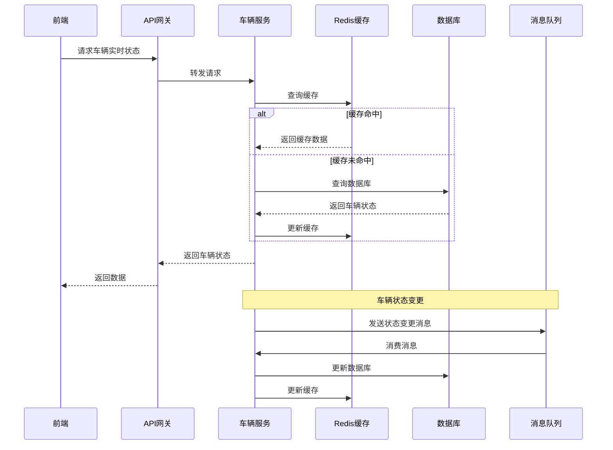

# MineGuard 后端架构设计文档

## 1. 技术选型

### 1.1 核心技术栈
- **语言**：Java 17
- **框架**：Spring Boot 3.0
- **微服务框架**：Spring Cloud Alibaba
- **数据库**：MySQL 8.0
- **缓存**：Redis
- **搜索引擎**：Elasticsearch
- **消息队列**：RocketMQ

### 1.2 技术特性
- **微服务架构**：服务拆分、独立部署
- **高可用性**：集群部署、负载均衡
- **可扩展性**：服务横向扩展
- **安全性**：认证授权、数据加密

## 2. 系统架构

### 2.1 架构图

```
+---------------------+     +---------------------+     +---------------------+
|                     |     |                     |     |                     |
|   前端应用 (uni-app)  | <--> |  API 网关 (Gateway)  | <--> |  微服务集群         |
|                     |     |                     |     |                     |
+---------------------+     +---------------------+     +---------------------+
                                                            |
                                                            |
                                                            v
                                                    +---------------------+
                                                    |                     |
                                                    |  中间件服务         |
                                                    |                     |
                                                    +---------------------+
                                                            |
                                                            |
                                                            v
                                                    +---------------------+
                                                    |                     |
                                                    |  数据存储           |
                                                    |                     |
                                                    +---------------------+
```

### 2.2 服务拆分

| 服务名称 | 服务说明 | 端口 | 主要功能 |
|---------|---------|------|---------|
| user-service | 用户服务 | 8001 | 用户管理、认证授权 |
| vehicle-service | 车辆服务 | 8002 | 车辆管理、状态监控 |
| trip-service | 行程服务 | 8003 | 行程记录、路线规划 |
| warning-service | 预警服务 | 8004 | 预警管理、事件处理 |
| statistics-service | 统计服务 | 8005 | 数据分析、报表生成 |
| cost-service | 成本服务 | 8006 | 成本核算、费用管理 |

### 2.3 核心流程图

#### 车辆状态监控流程



## 3. 数据库设计

### 3.1 核心表结构

#### 1. 用户表 (user)
| 字段名 | 数据类型 | 约束 | 描述 |
|-------|---------|------|------|
| id | BIGINT | PRIMARY KEY | 用户ID |
| username | VARCHAR(50) | UNIQUE | 用户名 |
| password | VARCHAR(100) | NOT NULL | 密码 |
| role | VARCHAR(20) | NOT NULL | 角色 |
| name | VARCHAR(50) | NOT NULL | 姓名 |
| phone | VARCHAR(20) | NOT NULL | 手机号 |
| create_time | DATETIME | NOT NULL | 创建时间 |
| update_time | DATETIME | NOT NULL | 更新时间 |

#### 2. 车辆表 (car)
| 字段名 | 数据类型 | 约束 | 描述 |
|-------|---------|------|------|
| id | BIGINT | PRIMARY KEY | 车辆ID |
| car_number | VARCHAR(20) | UNIQUE | 车牌号 |
| vehicle_type | VARCHAR(50) | NOT NULL | 车辆类型 |
| model | VARCHAR(50) | NOT NULL | 车型 |
| status | VARCHAR(20) | NOT NULL | 状态 |
| purchase_date | DATE | NOT NULL | 购买日期 |
| insurance_company | VARCHAR(100) | | 保险公司 |
| insurance_number | VARCHAR(100) | | 保险单号 |
| insurance_expiry | DATE | | 保险到期日 |
| create_time | DATETIME | NOT NULL | 创建时间 |
| update_time | DATETIME | NOT NULL | 更新时间 |

#### 3. 司机表 (driver)
| 字段名 | 数据类型 | 约束 | 描述 |
|-------|---------|------|------|
| id | BIGINT | PRIMARY KEY | 司机ID |
| name | VARCHAR(50) | NOT NULL | 姓名 |
| phone | VARCHAR(20) | NOT NULL | 手机号 |
| license_number | VARCHAR(50) | UNIQUE | 驾驶证号 |
| status | VARCHAR(20) | NOT NULL | 状态 |
| create_time | DATETIME | NOT NULL | 创建时间 |
| update_time | DATETIME | NOT NULL | 更新时间 |

#### 4. 行程记录表 (trip_record)
| 字段名 | 数据类型 | 约束 | 描述 |
|-------|---------|------|------|
| id | BIGINT | PRIMARY KEY | 行程ID |
| car_id | BIGINT | FOREIGN KEY | 车辆ID |
| driver_id | BIGINT | FOREIGN KEY | 司机ID |
| route_id | BIGINT | FOREIGN KEY | 路线ID |
| start_time | DATETIME | NOT NULL | 开始时间 |
| end_time | DATETIME | | 结束时间 |
| start_point | VARCHAR(100) | NOT NULL | 起点 |
| end_point | VARCHAR(100) | NOT NULL | 终点 |
| distance | DOUBLE | | 距离 |
| load_weight | DOUBLE | | 载重 |
| status | VARCHAR(20) | NOT NULL | 状态 |
| create_time | DATETIME | NOT NULL | 创建时间 |
| update_time | DATETIME | NOT NULL | 更新时间 |

#### 5. 预警记录表 (warning_record)
| 字段名 | 数据类型 | 约束 | 描述 |
|-------|---------|------|------|
| id | BIGINT | PRIMARY KEY | 预警ID |
| car_id | BIGINT | FOREIGN KEY | 车辆ID |
| driver_id | BIGINT | FOREIGN KEY | 司机ID |
| warning_type | VARCHAR(50) | NOT NULL | 预警类型 |
| warning_level | VARCHAR(20) | NOT NULL | 预警级别 |
| warning_time | DATETIME | NOT NULL | 预警时间 |
| location | VARCHAR(100) | | 位置 |
| description | TEXT | | 描述 |
| status | VARCHAR(20) | NOT NULL | 状态 |
| create_time | DATETIME | NOT NULL | 创建时间 |
| update_time | DATETIME | NOT NULL | 更新时间 |

#### 6. 车辆实时状态表 (vehicle_realtime_status)
| 字段名 | 数据类型 | 约束 | 描述 |
|-------|---------|------|------|
| id | BIGINT | PRIMARY KEY | ID |
| car_id | BIGINT | FOREIGN KEY | 车辆ID |
| longitude | DOUBLE | | 经度 |
| latitude | DOUBLE | | 纬度 |
| speed | DOUBLE | | 速度 |
| status | VARCHAR(20) | | 状态 |
| fuel_level | DOUBLE | | 油量 |
| last_update_time | DATETIME | NOT NULL | 最后更新时间 |

### 3.2 索引设计

| 表名 | 索引名 | 索引类型 | 字段 | 描述 |
|-----|-------|---------|------|------|
| user | idx_username | UNIQUE | username | 用户名索引 |
| car | idx_car_number | UNIQUE | car_number | 车牌号索引 |
| car | idx_vehicle_type | NORMAL | vehicle_type | 车辆类型索引 |
| car | idx_status | NORMAL | status | 状态索引 |
| driver | idx_license_number | UNIQUE | license_number | 驾驶证号索引 |
| trip_record | idx_car_id | NORMAL | car_id | 车辆ID索引 |
| trip_record | idx_driver_id | NORMAL | driver_id | 司机ID索引 |
| trip_record | idx_start_time | NORMAL | start_time | 开始时间索引 |
| warning_record | idx_car_id | NORMAL | car_id | 车辆ID索引 |
| warning_record | idx_warning_time | NORMAL | warning_time | 预警时间索引 |
| warning_record | idx_warning_type | NORMAL | warning_type | 预警类型索引 |
| vehicle_realtime_status | idx_car_id | NORMAL | car_id | 车辆ID索引 |
| vehicle_realtime_status | idx_last_update_time | NORMAL | last_update_time | 最后更新时间索引 |

### 3.3 分区设计

| 表名 | 分区类型 | 分区字段 | 分区策略 |
|-----|---------|---------|----------|
| trip_record | RANGE | start_time | 按年分区 |
| warning_record | RANGE | warning_time | 按年分区 |

## 4. 接口设计

### 4.1 认证授权接口

| API路径 | 方法 | 模块 | 功能描述 | 请求体 (JSON) | 成功响应 (200 OK) |
|--------|------|------|----------|--------------|-------------------|
| /api/auth/login | POST | user-service | 用户登录 | {"username": "admin", "password": "123456", "role": "admin"} | {"token": "...", "userInfo": {...}} |
| /api/auth/logout | POST | user-service | 用户登出 | {} | {"code": 200, "message": "success"} |
| /api/auth/refresh | POST | user-service | 刷新令牌 | {"token": "..."} | {"token": "..."} |

### 4.2 车辆管理接口

| API路径 | 方法 | 模块 | 功能描述 | 请求体 (JSON) | 成功响应 (200 OK) |
|--------|------|------|----------|--------------|-------------------|
| /api/vehicle/list | GET | vehicle-service | 获取车辆列表 | N/A | {"total": 100, "data": [...]} |
| /api/vehicle/detail/{id} | GET | vehicle-service | 获取车辆详情 | N/A | {"id": 1, "carNumber": "鄂A12345", ...} |
| /api/vehicle/status | GET | vehicle-service | 获取车辆实时状态 | N/A | {"carId": 1, "status": "running", ...} |
| /api/vehicle/add | POST | vehicle-service | 添加车辆 | {"carNumber": "鄂A12345", "vehicleType": "重型卡车", ...} | {"code": 200, "message": "success"} |
| /api/vehicle/update | PUT | vehicle-service | 更新车辆信息 | {"id": 1, "status": "idle", ...} | {"code": 200, "message": "success"} |
| /api/vehicle/delete/{id} | DELETE | vehicle-service | 删除车辆 | N/A | {"code": 200, "message": "success"} |

### 4.3 行程管理接口

| API路径 | 方法 | 模块 | 功能描述 | 请求体 (JSON) | 成功响应 (200 OK) |
|--------|------|------|----------|--------------|-------------------|
| /api/trip/list | GET | trip-service | 获取行程列表 | N/A | {"total": 100, "data": [...]} |
| /api/trip/detail/{id} | GET | trip-service | 获取行程详情 | N/A | {"id": 1, "carId": 1, ...} |
| /api/trip/add | POST | trip-service | 添加行程 | {"carId": 1, "driverId": 1, ...} | {"code": 200, "message": "success"} |
| /api/trip/update | PUT | trip-service | 更新行程 | {"id": 1, "status": "completed", ...} | {"code": 200, "message": "success"} |
| /api/trip/delete/{id} | DELETE | trip-service | 删除行程 | N/A | {"code": 200, "message": "success"} |

### 4.4 预警管理接口

| API路径 | 方法 | 模块 | 功能描述 | 请求体 (JSON) | 成功响应 (200 OK) |
|--------|------|------|----------|--------------|-------------------|
| /api/warning/list | GET | warning-service | 获取预警列表 | N/A | {"total": 100, "data": [...]} |
| /api/warning/detail/{id} | GET | warning-service | 获取预警详情 | N/A | {"id": 1, "carId": 1, ...} |
| /api/warning/handle/{id} | PUT | warning-service | 处理预警 | {"status": "handled", ...} | {"code": 200, "message": "success"} |

### 4.5 统计分析接口

| API路径 | 方法 | 模块 | 功能描述 | 请求体 (JSON) | 成功响应 (200 OK) |
|--------|------|------|----------|--------------|-------------------|
| /api/statistics/overview | GET | statistics-service | 获取数据概览 | N/A | {"vehicleCount": 128, "onlineCount": 96, ...} |
| /api/statistics/trip | GET | statistics-service | 获取行程统计 | N/A | {"totalTrips": 1000, "completedTrips": 950, ...} |
| /api/statistics/warning | GET | statistics-service | 获取预警统计 | N/A | {"totalWarnings": 50, "handledWarnings": 45, ...} |
| /api/statistics/cost | GET | statistics-service | 获取成本统计 | N/A | {"totalCost": 100000, "fuelCost": 60000, ...} |

## 5. 技术实现

### 5.1 微服务实现

#### 1. 服务注册与发现
- **组件**：Nacos
- **配置**：服务注册到 Nacos 服务器
- **功能**：服务自动发现、负载均衡

#### 2. 配置中心
- **组件**：Nacos Config
- **配置**：集中管理服务配置
- **功能**：动态配置更新、配置版本管理

#### 3. 网关
- **组件**：Spring Cloud Gateway
- **配置**：路由规则、过滤器
- **功能**：请求转发、认证授权、限流

#### 4. 服务调用
- **组件**：OpenFeign
- **配置**：服务接口定义
- **功能**：声明式服务调用、负载均衡

#### 5. 熔断降级
- **组件**：Sentinel
- **配置**：熔断规则、降级策略
- **功能**：服务保护、故障隔离

#### 6. 分布式事务
- **组件**：Seata
- **配置**：事务组、模式
- **功能**：分布式事务协调、一致性保证

### 5.2 缓存实现

#### 1. 缓存策略
- **缓存级别**：
  - 本地缓存：Caffeine
  - 分布式缓存：Redis
- **缓存键设计**：
  - 车辆状态：`vehicle:status:{carId}`
  - 用户信息：`user:{userId}`
  - 统计数据：`statistics:{type}:{date}`

#### 2. 缓存更新
- **更新策略**：
  - 主动更新：数据变更时更新缓存
  - 被动更新：缓存过期后重新加载
- **过期时间**：
  - 车辆状态：30秒
  - 用户信息：30分钟
  - 统计数据：1小时

### 5.3 消息队列实现

#### 1. 消息主题
- **车辆状态**：`vehicle-status-change`
- **预警信息**：`warning-notification`
- **行程完成**：`trip-completed`
- **统计数据**：`statistics-update`

#### 2. 消息处理
- **生产者**：服务发送消息
- **消费者**：服务消费消息
- **消息类型**：
  - 同步消息：实时处理
  - 异步消息：批量处理

## 6. 部署方案

### 6.1 环境准备

| 环境 | 版本 | 配置 | 用途 |
|-----|------|------|------|
| JDK | 17+ | - | 运行环境 |
| MySQL | 8.0+ | 4C8G | 数据库 |
| Redis | 7.0+ | 4C8G | 缓存 |
| Nacos | 2.0+ | 4C8G | 服务注册与配置 |
| RocketMQ | 4.9+ | 4C8G | 消息队列 |
| Sentinel | 1.8+ | 2C4G | 熔断降级 |
| Seata | 1.5+ | 2C4G | 分布式事务 |

### 6.2 部署方式

#### 1. 容器化部署
- **工具**：Docker、Docker Compose
- **镜像**：
  - 基础镜像：OpenJDK 17
  - 服务镜像：各微服务
- **编排**：
  - Docker Compose：本地开发
  - Kubernetes：生产环境

#### 2. 集群部署
- **服务集群**：
  - 每个服务至少部署2个实例
  - 通过 Nacos 实现服务发现
- **数据库集群**：
  - MySQL 主从复制
  - 读写分离
- **缓存集群**：
  - Redis 集群
  - 哨兵模式

### 6.3 监控告警

#### 1. 监控系统
- **组件**：Prometheus + Grafana
- **监控指标**：
  - JVM 指标：内存、CPU、线程
  - 应用指标：QPS、响应时间、错误率
  - 数据库指标：连接数、查询时间
  - 缓存指标：命中率、内存使用

#### 2. 告警系统
- **组件**：AlertManager
- **告警规则**：
  - 服务不可用：服务实例数 < 2
  - 响应时间：P95 > 500ms
  - 错误率：错误率 > 1%
  - 数据库连接：连接数 > 80%

## 7. 安全性设计

### 7.1 认证授权

#### 1. 认证
- **方式**：JWT
- **流程**：
  1. 用户登录，服务生成 JWT Token
  2. Token 存储在前端本地
  3. 请求时携带 Token
  4. 服务验证 Token 有效性

#### 2. 授权
- **方式**：基于角色的访问控制 (RBAC)
- **权限设计**：
  - 管理员：所有权限
  - 司机：仅查看自己的任务和车辆

### 7.2 数据安全

#### 1. 数据加密
- **传输加密**：HTTPS
- **存储加密**：
  - 密码：BCrypt 加密
  - 敏感信息：AES 加密

#### 2. 数据脱敏
- **字段脱敏**：
  - 手机号：中间4位脱敏
  - 身份证号：中间8位脱敏
  - 车牌号：首尾保留，中间脱敏

### 7.3 安全防护

#### 1. 接口防护
- **限流**：基于 IP、用户的限流
- **防重放**：请求签名、时间戳
- **输入校验**：参数校验、SQL 注入防护

#### 2. 日志审计
- **操作日志**：记录用户操作
- **安全日志**：记录异常访问
- **审计日志**：记录敏感操作

## 8. 开发规范

### 8.1 代码规范

#### 1. 命名规范
- **包名**：小写字母，单词间用点分隔
- **类名**：驼峰命名，首字母大写
- **方法名**：驼峰命名，首字母小写
- **变量名**：驼峰命名，首字母小写
- **常量名**：全大写，单词间用下划线分隔

#### 2. 代码风格
- **缩进**：4个空格
- **行宽**：不超过120个字符
- **注释**：
  - 类注释：说明类的功能
  - 方法注释：说明方法的功能、参数、返回值
  - 代码注释：说明关键代码的逻辑

### 8.2 分支管理

#### 1. 分支策略
- **main**：主分支，生产环境代码
- **develop**：开发分支，集成测试
- **feature/**：功能分支，开发新功能
- **bugfix/**：修复分支，修复生产bug
- **release/**：发布分支，准备发布

#### 2. 提交规范
- **提交信息**：
  - 格式：`类型(范围): 描述`
  - 类型：feat(新功能)、fix(修复)、docs(文档)、style(格式)、refactor(重构)、test(测试)、chore(构建)
  - 范围：模块名
  - 描述：简短描述

### 8.3 测试规范

#### 1. 测试类型
- **单元测试**：测试单个方法
- **集成测试**：测试模块间集成
- **接口测试**：测试 API 接口
- **性能测试**：测试系统性能

#### 2. 测试覆盖率
- **目标**：
  - 单元测试：80%+
  - 集成测试：70%+
  - 接口测试：100%

## 9. 性能优化

### 9.1 数据库优化

#### 1. 查询优化
- **索引优化**：合理创建索引
- **SQL 优化**：避免全表扫描
- **分页优化**：使用游标、限制查询

#### 2. 存储优化
- **分区表**：按时间分区
- **分库分表**：水平拆分大表
- **读写分离**：主库写，从库读

### 9.2 应用优化

#### 1. 代码优化
- **缓存使用**：减少数据库查询
- **异步处理**：耗时操作异步化
- **批量处理**：批量操作减少网络开销

#### 2. 网络优化
- **连接池**：数据库、Redis 连接池
- **压缩**：HTTP 响应压缩
- **CDN**：静态资源加速

### 9.3 系统优化

#### 1. 资源优化
- **JVM 调优**：内存分配、GC 策略
- **线程池**：合理配置线程数
- **连接数**：限制最大连接数

#### 2. 监控优化
- **指标监控**：关键指标实时监控
- **告警优化**：合理设置告警阈值
- **日志优化**：日志级别、滚动策略

## 10. 总结

本架构设计文档详细说明了 MineGuard 后端系统的技术选型、架构设计、数据库设计、接口设计、技术实现、部署方案、安全性设计、开发规范和性能优化。通过微服务架构，实现了高可用、可扩展的矿山车辆运输管理系统后端，为前端应用提供稳定、高效的 API 服务。系统采用 Spring Cloud Alibaba 技术栈，集成了服务注册与发现、配置中心、网关、熔断降级、分布式事务等核心组件，确保了系统的可靠性和稳定性。